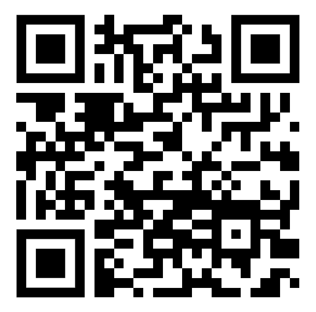

# QR Code Decoder

A PWA that provides a step-by step explanation how to extract the information stored in a QR-Code from an image.

## Hosted version

Hosted and installable (as a [PWA](https://web.dev/progressive-web-apps/)) under [https://jonas-kell.github.io/qr-code-decoder/#/](https://jonas-kell.github.io/qr-code-decoder/#/).



## Local testing

Run in the base of the project:

```shell
docker compose up
```

See here: [http://localhost:9999/](http://localhost:9999/).

<!--
Sources:

https://github.com/ErenKaymakci/Real-Time-QR-Detection-and-Decoding
 -->
